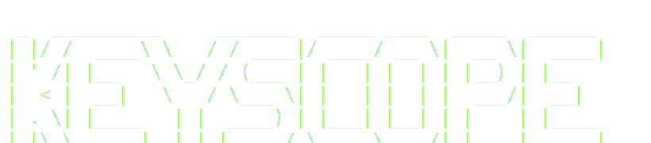

<p align="center">
  
</p>

Composable, scoped keyboard navigation hooks for React.

> **Early release** — API is stable, docs are catching up.

## Why

Every component library ends up writing the same keyboard code. Arrow keys for lists, Escape for dialogs, Tab trapping for modals, hotkeys for power users. It's always a mess of `addEventListener`, `useEffect` cleanup, stale closures, and handlers that fire when they shouldn't.

The real problem is layering. Open a command palette over a dialog over the main app — which Escape handler fires? Most hotkey libraries don't care. You end up writing your own scope management every time.

keyscope handles this with a scope stack. Push a scope when a dialog opens, pop it when it closes. Only the topmost scope receives events. No conflicts, no manual cleanup. React 19's `useEffectEvent` means handlers always see fresh state without `useCallback` wrappers.

I extracted this from [diffgazer](https://github.com/b4r7x/diffgazer) after building the same keyboard patterns for the third time. Now it's one `npm install` instead of 500 lines of custom hooks.

## Features

- **Scoped** — handlers only fire in the active scope. Modal layering, dialogs, nested UIs just work.
- **Composable** — `useKey` for hotkeys, `useNavigation` for lists, `useFocusZone` for panels. Mix and match.
- **ARIA-native** — `useNavigation` queries `[role][data-value]` elements. Space selects, Enter activates, arrows move.
- **Zone system** — `useFocusZone` + `forZone` let you bind the same key to different actions per zone (sidebar Enter vs content Enter).
- **Focus trapping** — `useFocusTrap` keeps Tab within a container. Works independently of the scope system.
- **Vim-friendly** — `keys()` utility maps multiple keys to one handler. `j`/`ArrowDown`, `k`/`ArrowUp`, etc.
- **Tiny** — ~1.5 KB gzipped, zero dependencies, ESM only.
- **React 19** — uses `useEffectEvent` for stable handlers. No stale closures, no `useCallback`.

## Install

```bash
npm install keyscope
```

Requires React 19+ as a peer dependency.

## Quick start

```tsx
import { KeyboardProvider, useKey } from "keyscope";

function App() {
  return (
    <KeyboardProvider>
      <Editor />
    </KeyboardProvider>
  );
}

function Editor() {
  useKey("ctrl+s", (e) => {
    e.preventDefault();
    save();
  });

  useKey("Escape", () => close());

  return <div>...</div>;
}
```

Wrap your app with `KeyboardProvider`. Use `useKey` anywhere inside. That's it.

## Docs

- [API Reference](docs/api.md) — every hook, every option, every default
- **Guides**
  - [Scopes](docs/guides/scopes.md) — scope stack, layering, common mistakes
  - [List navigation](docs/guides/navigation.md) — useNavigation, useTabNavigation, DOM setup
  - [Focus zones](docs/guides/focus-zones.md) — zones, forZone, transitions
  - [Focus & scroll](docs/guides/focus-and-scroll.md) — useFocusTrap, useScrollLock

## API

### KeyboardProvider

Manages a scope stack and dispatches keyboard events to handlers in the active scope.

```tsx
<KeyboardProvider>
  {children}
</KeyboardProvider>
```

Starts with a `"global"` scope. When a scope is pushed (via `useScope`), only handlers in the topmost scope receive events. When that scope unmounts, the previous scope becomes active again.

### useKey

Register keyboard handlers. Three overloads:

```tsx
// Single key
useKey("Escape", () => close());
useKey("ctrl+k", () => openSearch(), { preventDefault: true });

// Array of keys, same handler
useKey(["ArrowUp", "ArrowDown"], (e) => {
  navigate(e.key === "ArrowUp" ? -1 : 1);
});

// Key map, different handlers
useKey({
  "ArrowUp": () => move(-1),
  "ArrowDown": () => move(1),
  "Enter": () => select(),
});
```

### useScope

Push a named scope. While active, only handlers in this scope fire. Pops automatically on unmount.

```tsx
function Modal({ open }: { open: boolean }) {
  useScope("modal", { enabled: open });
  useKey("Escape", () => close());

  if (!open) return null;
  return <div>...</div>;
}
```

### useFocusZone

Manage logical focus zones with arrow key and Tab transitions.

```tsx
type Zone = "sidebar" | "content" | "preview";

const { zone, forZone } = useFocusZone({
  initial: "sidebar",
  zones: ["sidebar", "content", "preview"] as const,
  tabCycle: ["sidebar", "content", "preview"] as const,
  transitions: ({ zone, key }) => {
    if (zone === "sidebar" && key === "ArrowRight") return "content";
    if (zone === "content" && key === "ArrowLeft") return "sidebar";
    if (zone === "content" && key === "ArrowRight") return "preview";
    return null;
  },
});

// forZone binds the same key to different actions per zone
useKey("Enter", () => openItem(), forZone("sidebar"));
useKey("Enter", () => editContent(), forZone("content"));
```

`forZone` returns `{ enabled: true }` when the current zone matches, `{ enabled: false }` otherwise. Pass extra options as a second argument: `forZone("sidebar", { preventDefault: true })`.

`tabCycle` enables Tab/Shift+Tab to cycle through zones in order.

<details>
<summary>Full options and return types</summary>

```ts
interface UseFocusZoneOptions<T extends string> {
  initial: T;
  zones: readonly T[];
  zone?: T;                                    // controlled mode
  onZoneChange?: (zone: T) => void;
  onLeaveZone?: (zone: T) => void;
  onEnterZone?: (zone: T) => void;
  transitions?: (params: {
    zone: T;
    key: "ArrowLeft" | "ArrowRight" | "ArrowUp" | "ArrowDown" | "Tab";
  }) => T | null;
  tabCycle?: readonly T[];
  scope?: string;
  enabled?: boolean;
}

interface UseFocusZoneReturn<T extends string> {
  zone: T;
  setZone: (zone: T) => void;
  inZone: (...zones: T[]) => boolean;
  forZone: (target: T, extra?: UseKeyOptions) => UseKeyOptions;
}
```

</details>

### useNavigation

Full list navigation — arrow keys, Home/End, selection, focus tracking. Queries `[role][data-value]` elements from the DOM.

```tsx
const containerRef = useRef<HTMLDivElement>(null);

const { focusedValue, isFocused } = useNavigation({
  containerRef,
  role: "option",
  onSelect: (value) => toggleItem(value),
  onEnter: (value) => openItem(value),
  wrap: true,
});
```

`onSelect` fires on **Space** (ARIA selection), `onEnter` fires on **Enter** (ARIA activation). If `onEnter` is not provided, Enter falls back to `onSelect`.

**Local mode** returns an `onKeyDown` handler you attach yourself, useful for components that manage their own events:

```tsx
const { onKeyDown } = useNavigation({
  containerRef,
  role: "menuitem",
  mode: "local",
  onSelect: (value) => activate(value),
});

return <div ref={containerRef} onKeyDown={onKeyDown}>...</div>;
```

<details>
<summary>Full options and return types</summary>

```ts
interface UseNavigationBaseOptions {
  containerRef: RefObject<HTMLElement | null>;
  role: NavigationRole;                        // "radio" | "checkbox" | "option" | "menuitem"
  value?: string | null;                       // controlled focused value
  onValueChange?: (value: string) => void;
  onSelect?: (value: string, event: KeyboardEvent) => void;
  onEnter?: (value: string, event: KeyboardEvent) => void;
  preventDefault?: boolean;                    // default: true
  onFocusChange?: (value: string) => void;
  wrap?: boolean;                              // default: true
  enabled?: boolean;                           // default: true
  onBoundaryReached?: (direction: "up" | "down") => void;
  initialValue?: string | null;
  orientation?: "vertical" | "horizontal";     // default: "vertical"
  skipDisabled?: boolean;
  upKeys?: string[];
  downKeys?: string[];
}

// Scoped mode (default)
interface UseScopedNavigationOptions extends UseNavigationBaseOptions {
  mode?: "scoped";
  requireFocusWithin?: boolean;
}

// Local mode
interface UseLocalNavigationOptions extends UseNavigationBaseOptions {
  mode: "local";
}

interface UseNavigationReturn {
  focusedValue: string | null;
  isFocused: (value: string) => boolean;
  focus: (value: string) => void;
  onKeyDown?: (event: KeyboardEvent) => void;  // only in local mode
}
```

</details>

### useTabNavigation

Arrow keys and Home/End for tab lists. Queries `[role="tab"]:not([disabled])` inside the container.

```tsx
const tabListRef = useRef<HTMLDivElement>(null);
const { onKeyDown } = useTabNavigation({ containerRef: tabListRef });

return (
  <div ref={tabListRef} role="tablist" onKeyDown={onKeyDown}>
    <button role="tab">Tab 1</button>
    <button role="tab">Tab 2</button>
  </div>
);
```

### useFocusTrap

Trap Tab within a container. Focus restores when the trap is disabled or unmounts.

```tsx
const containerRef = useRef<HTMLDivElement>(null);
useFocusTrap(containerRef, { enabled: isOpen });
```

Queries focusable elements on each Tab press, so dynamic content is handled automatically.

> `useFocusTrap` operates independently of `KeyboardProvider` — it attaches its own listener on the container. This is by design: focus trapping is a DOM-level concern.

### useScrollLock

Lock scroll on an element. Reference-counted — multiple locks on the same element stack correctly.

```tsx
useScrollLock(containerRef, isOpen);
```

### keys()

Build a key map from an array. Useful with the map overload of `useKey`.

```tsx
useKey({
  ...keys(["j", "ArrowDown"], () => move(1)),
  ...keys(["k", "ArrowUp"], () => move(-1)),
  "/": () => focusSearch(),
});
```

### useOptionalKeyboardContext

Returns the keyboard context or `null` if no `KeyboardProvider` exists. For libraries that optionally integrate with keyscope.

## Options

`UseKeyOptions` is shared across `useKey` and returned by `forZone`:

| Option | Type | Default | Description |
|---|---|---|---|
| `enabled` | `boolean` | `true` | Enable/disable the handler |
| `allowInInput` | `boolean` | `false` | Fire when input/textarea/select is focused |
| `targetRef` | `RefObject<HTMLElement \| null>` | — | Only fire when target is within this element |
| `requireFocusWithin` | `boolean` | `false` | Require focus within `targetRef` |
| `preventDefault` | `boolean` | `false` | Call `event.preventDefault()` before handler |

## Key matching

Hotkey strings are **case-insensitive** — `"escape"` and `"Escape"` both work.

**Uppercase letters imply Shift.** `"G"` matches Shift+G. Lowercase `"g"` matches g without Shift.

**Strict modifiers.** `"ctrl+s"` only matches Ctrl+S, not Ctrl+Shift+S.

```tsx
useKey("g", () => goToTop());       // g (no Shift)
useKey("G", () => goToBottom());    // Shift+G
useKey("ctrl+s", () => save());     // Ctrl+S only
useKey("mod+k", () => search());    // Meta+K on Mac, Ctrl+K elsewhere
```

## Patterns

### Scoped modals

```tsx
function ConfirmDialog({ open, onConfirm, onCancel }) {
  useScope("confirm-dialog", { enabled: open });
  useKey("Enter", onConfirm);
  useKey("Escape", onCancel);

  if (!open) return null;
  return <div role="dialog">...</div>;
}
```

While open, only the dialog's handlers fire. Parent handlers pause until it unmounts.

### Vim-style navigation

```tsx
useKey({
  ...keys(["j", "ArrowDown"], () => move(1)),
  ...keys(["k", "ArrowUp"], () => move(-1)),
  ...keys(["g", "Home"], () => first()),
  ...keys(["G", "End"], () => last()),
  "/": () => focusSearch(),
  "Escape": () => clearSearch(),
});
```

### Command palette

```tsx
function CommandPalette() {
  const [open, setOpen] = useState(false);
  const containerRef = useRef<HTMLDivElement>(null);

  useKey("ctrl+k", () => setOpen(true), { preventDefault: true });
  useScope("command-palette", { enabled: open });
  useKey("Escape", () => setOpen(false));

  const { isFocused } = useNavigation({
    containerRef,
    role: "option",
    onSelect: (value) => runCommand(value),
    enabled: open,
  });

  if (!open) return null;

  return (
    <div ref={containerRef}>
      <input placeholder="Search commands..." />
      <div role="listbox">
        <div role="option" data-value="save" data-focused={isFocused("save")}>Save</div>
        <div role="option" data-value="open" data-focused={isFocused("open")}>Open</div>
      </div>
    </div>
  );
}
```

## Requirements

- React 19+ (uses `useEffectEvent`)
- ESM only

## Built with

TypeScript · React 19 · Vitest

## License

MIT
